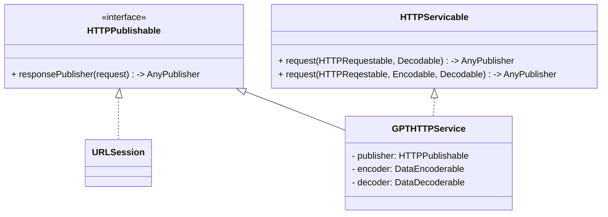

# Chat-bot(GPT) Project

## 기간
2024.01.02 ~ 2024.01.26

## 개요
OpenAI의 ChatGPT를 사용하여, 사용자에 대한 질문을 챗봇이 답변해주는 앱.

## 사용 기술
`Combine`, `UIKit`, `CoreData`, `XCTest`

## 구현 영상
| 채팅방 생성 및 채팅 | 프롬프트 생성 및 채팅 | Persistence 저장 |
| ----------- | --------- | -------- |
|  |  |  |

## 객체의 역할
### Application
| 이름 | 타입 | 역할 |
| ---- | ---- | ---- |
| AppEnviroment | `struct` | 자주 쓰이는 타입을 인스턴스화 하여 정적 프로퍼티로 저장하는 컨테이너

### Data
| 이름 | 타입 | 역할 |
| ---- | ---- | ---- |
| DataDecoderable | `protocol` | 데이터를 디코딩하기 위한 프로토콜(추후에 JSON 디코딩 말고 다른 방식도 생길 수 있다고 가정.)
| JSONDecoder | `extension` | DataDecoderable을 채택하고 `try self.decode(_, from: _)`를 통해 내부 구현함.
| DataEncoderable | `protocol` | 데이터를 인코딩하기 위한 프로토콜(추후에 JSON 인코딩 말고 다른 방식도 생길 수 있다고 가정.)
| JSONEnecoder | `extension` | DataDecoderable을 채택하고 `try self.encode(_)`를 통해 내부 구현함.

### Network
| 이름 | 타입 | 역할 |
| ---- | ---- | ---- |
| HTTPPublishable | `protocol` | `URLRequest`를 받아, AnyPublisher로 반환하기 위한 프로토콜
| URLSession | `extension` | `HTTPPublisherable`을 채택하여 `dataTaskPublisher(for: _)`를 활용하여 `AnyPublisher`를 반환.
| HTTPRequestable | `protocol` | EndPoint를 담기 위한 프로토콜
| HTTPServicable | `protocol` | data를 디코딩 및 인코딩하여 서버와 통신하기 위한 프로토콜 |
| GPTHTTPService | `final class` | HTTPServicable을 채택한 클래스 |

#### Diagram

### Repository
| 이름 | 타입 | 역할 |
| ---- | ---- | ---- |
| CoreDataRepository | `final class` | `NSPersistantContainer`를 관리하기 위한 객체 |
| ChatRoomRepositable | `protocol` | 채팅방의 CRUD를 관리하기 위한 프로토콜
| CoreDataChatRoomRepository | `final class` | CoreDataRepository를 활용하여 로컬 저장소에 채팅방을 CRUD를 하기 위한 객체

#### Diagram

```mermaid
classDiagram

class CoreDataRepository {
  - persistenceContainer: NSPersistentContainer
  + context: NSManagedObjectContext

  + saveContext()
  + resetContext()
}

class ChatRoomRepositable {
  <<interface>>
  + func fetchChatRoomList() throws -> [GPTChatRoomDTO]
  + func storeChatRoom(chatRoom: GPTChatRoomDTO) throws
  + func modifyChatRoom(chatRoom: GPTChatRoomDTO) throws
  + func removeChatRoom(chatRoom: GPTChatRoomDTO) throws
}

class ChattingRepositable {
  <<interface>>
  + fetchChattings(chatRoomDTO: GPTChatRoomDTO) throws -> [Model.GPTMessage]
  + func storeChattings(chattings: [Model.GPTMessage], chatRoomDTO: Model.GPTChatRoomDTO) throws
}

class PromptSettingRepositable {
  <<interface>>
  func fetchPromptSetting(chatRoom: GPTChatRoomDTO) throws -> SystemMessage?
  func modifyPromptSetting(systemMessage: SystemMessage, chatRoom: GPTChatRoomDTO) throws
  func deletePromptSetting(chatRoom: GPTChatRoomDTO) throws
  func storePromptSetting(systemMessage: SystemMessage, chatRoom: GPTChatRoomDTO) throws
}

class CoreDataChatRoomRepository { }

class CoreDataChattingRepository {
  - fetchChatRoom(hatRoomDTO: Model.GPTChatRoomDTO) throws -> ChatRoom
}

class CoreDataPromptSettingRepository {
  - private func fetchChatRoom(chatRoom: GPTChatRoomDTO) throws -> ChatRoom
}

ChatRoomRepositable <|.. CoreDataChatRoomRepository
ChattingRepositable <|.. CoreDataChattingRepository
PromptSettingRepositable <|.. CoreDataPromptSettingRepository

CoreDataRepository <|-- CoreDataChatRoomRepository
CoreDataRepository <|-- CoreDataChattingRepository
CoreDataRepository <|-- CoreDataPromptSettingRepository
```

## Trouble Shooting
### MVVM
이전에는 ViewController에 뷰에 대한 코드와 비즈니스 로직을 담다보니, ViewController의 코드가 길어졌습니다. 또한 ViewController의 비즈니스 로직에 단위 테스트를 해보려 했으나 뷰와 결합되어 있었기에 테스트하는데 어려움이 있었습니다. 따라서 뷰와 비즈니스 로직의 분리, 단위 테스트의 용이성을 위해 MVVM 패턴을 프로젝트에 적용했습니다.
View와 ViewModel에서 `Combine`을 이용하여 Subject를 변환한 AnyPublisher와 뷰의 컴포넌트들과 바인딩 을 했습니다.

### Unit Test
채팅 뷰 모델은 네트워크 레이어와 연결이 되어있습니다. 그러나 매 테스트마다 서버와 직접적으로 통신할 경우, 통신으로 인한 비용과 서버에 유효하지 않은 데이터가 기입될 가능성이 있다고 생각했습니다. 따라서 HTTPPublishable을 채택한 Mock・Stub Publisher를 만들어서 네트워크가 연결된 상황이 아니어도 테스트를 할 수 있도록 했습니다.

## PR List
[STEP 1 PR](https://github.com/tasty-code/ios-chat-bot/pull/4)

[STEP 2 PR](https://github.com/tasty-code/ios-chat-bot/pull/17)

[STEP 3 PR](https://github.com/tasty-code/ios-chat-bot/pull/19)

[STEP 4 PR](https://github.com/tasty-code/ios-chat-bot/pull/24)

[STEP 5 PR](https://github.com/tasty-code/ios-chat-bot/pull/28)
